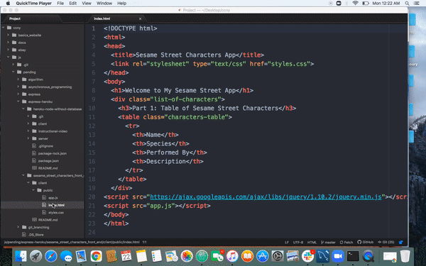

## Sesame Street Characters Front End
1. Calling the sesame street characters api that was created and deployed as part of [this](https://github.com/ccny-ss-js-dec-2020/sesame_street_characters_api) lesson from the front end

2. This is how to open the html file in chrome using the path to the html file in Atom

